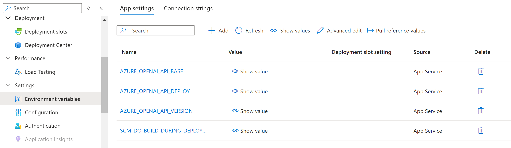
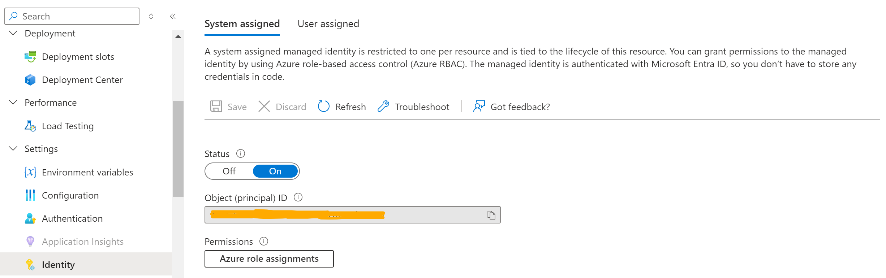
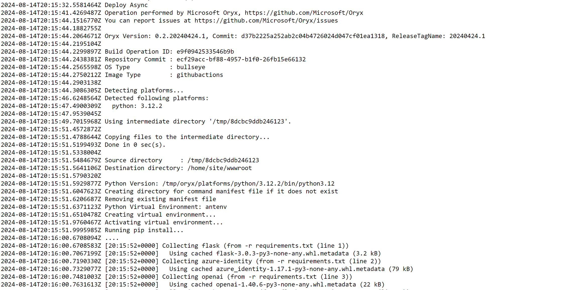
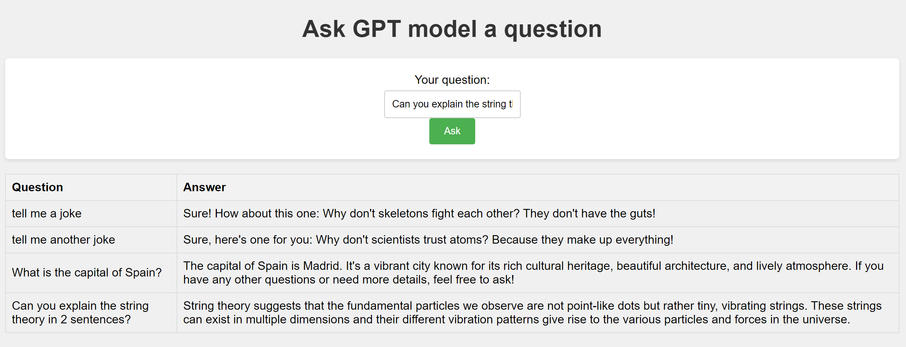

# Python Flask Web app with Azure OpenAI Integration
This guide walks you through deploying a minimalistic Flask application with Azure OpenAI's GPT integration to an Azure Web App.

### Step 1. Provision GPT model in Azure OpenAI:
- In Azure OpenAI / AI Studio, deploy the required GPT-x model;
- Take note of Azire OpenAI resource's endpoint, GPT model's deployment name and the API version you plan to use.

### Step 2. Prepare Azure Web App resource:
- In Azure, create a new Web app and select Python as your target language platform;
- In the Web app's **Environment Variables** settings, create the following variables and set them to the values collected from Step 1: ```AZURE_OPENAI_API_BASE```, ```AZURE_OPENAI_API_DEPLOY``` and ```AZURE_OPENAI_API_VERSION```;
- In the Web app's **Environment Variables** settings, create the variable ```SCM_DO_BUILD_DURING_DEPLOYMENT``` and set its value to "**true**";
> Note: The _SCM_DO_BUILD_DURING_DEPLOYMENT_ setting ensures that the Web app downloads required Python packages, listed in the provided _**requirements.txt**_ file.
- If set up correctly, your Web App settings should look similar to this:


### Step 3. Configure Authentication:
- In the Web app's **Identity** settings, set the status of system-assigned managed identity to _ON_;
> Note: this demo shows how to authenticate with a managed identity. You can find implementation details for other potential options [here](https://github.com/LazaUK/AOAI-EntraIDAuth-SDKv1).

- In Azure OpenAI's **Access Control (IAM)** settings, assign the Web app's managed identity the _Cognitive Services OpenAI User_ role.

### Step 4. Deploy Flask Web App:
- ZIP the provided ```app.py```, ```requirements.txt``` and the content of the ```static``` and ```templates``` folders (4 files in total);
- Deploy your ZIP file with the following Azure CLI command. Ensure you use the correct Resource Group, Web App and ZIP file names:
``` BASH
az webapp deploy --resource-group <Web_App_RG> --name <Web_App_Name> --src-path <Source_ZIP_file>
```
- As we enabled "build during deployment" in Step 2, you can verify from the Web App log that it pulled the required Python packages into the target Python virtual environment:


### Step 5. Web App UI:
- The home page of the Flask Web app is very minimalistic. You type your question, click the **Ask** button and the Web app adds a new pair of question/answers to its Web page:

